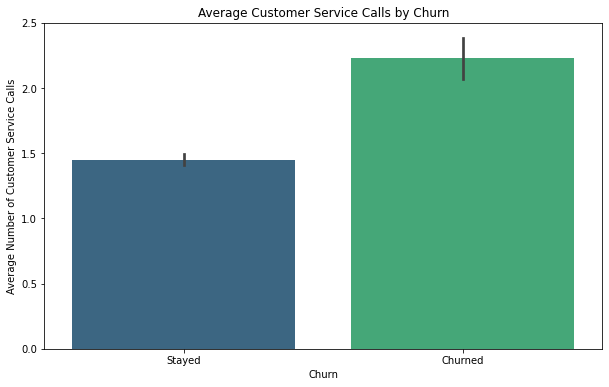
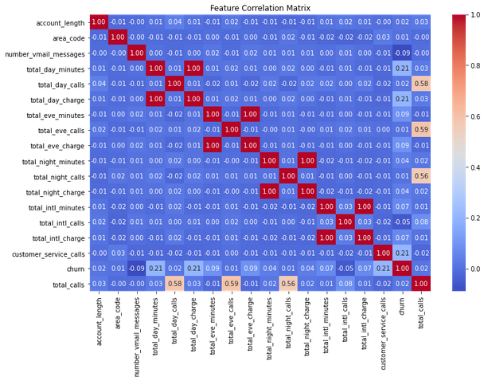
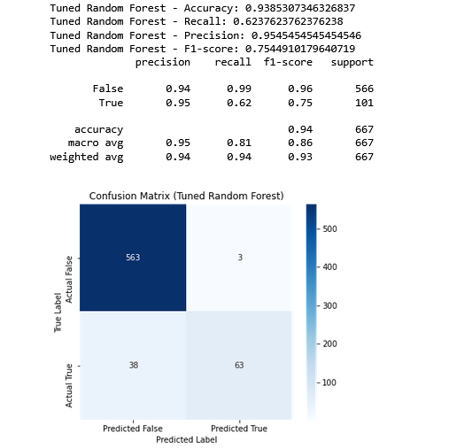

# SyriaTel Customer Churn Prediction and Retention Strategy

## Overview

SyraiTel, a telecomunications company faces challenges in customer retension as some users discontinue their services. By leveraging machine learing techniques, we aim to predict customer churn and provide strategic insights to help SyriaTel improve customer retention.

## Business Problem

Customer churn impacts SyriaTel revenue. The company needs an effective way to identify customers who are likely to leave and take proactive measures to retain them. Understanding the factors influencing churn will allow SyriaTel to enhance customer satisfaction, optimize marketing strategies, and improve overall business performance.

## Objectives:

Develop a machine learning model to predict whether a customer is likely to churn.

Identify key factors that influence customer churn.

Provide actionable insights to SyriaTel for improving customer retention strategies

## Data

The dataset for this project comes from Kaggle and contains customer data related to SyriaTel, a telecommunications company. This dataset is highly relevant to the problem of customer churn prediction. By analyzing customer behaviors and service usage patterns, we can identify key factors influencing churn. Understanding these factors will help SyriaTel develop effective strategies to retain customers, improve satisfaction, and reduce financial losses associated with customer attrition.

## Methods

n this project, we use descriptive statistical analysis to explore the customer churn data, followed by data cleaning, visualizations, and the application of various classification models to predict customer churn.

## Results

Based on the data and analysis, one of the key attributes predictive of churn is the number of customer service calls. Customers who have had more interactions with customer service tend to be more likely to churn

Other attributes that have some correlation with the churn are total day minutes, total day charge

The tuned Random Forest model shows excellent performance with a high accuracy (94%) and very good precision (95%)

## Conclusion

The Random Forest Classifier emerged as the best model for churn prediction, achieving the highest accuracy (93.85%) and a good balance between recall (0.62) and precision (0.95) after hyperparameter tuning. The Decision Tree Classifier also performed well with an accuracy of 92%.

Models like KNN, SVM, and Naive Bayes showed poorer performance and are not recommended for this task.

Based on the data and analysis, one of the key attributes predictive of churn is the number of customer service calls. Customers who have had more interactions with customer service tend to be more likely to churn

### Next Steps

- \*\* Model Comparison and Ensemble Learning -
  Combine different classification models into an ensemble model using Stacking or Voting Classifier. This could improve predictive performance.

- \*\* Handling Class Imbalance -
  Since the churn dataset may have imbalanced classes (fewer churned customers), techniques like SMOTE (Synthetic Minority Over-sampling Technique) or undersampling to balance the class distribution could be applied.

- \*\*Evaluate Models on new data
  Test the models on new or unseen data

- \*\* Deployment and Monitoring-
  Integrate the model into SyriaTel’s customer management system for real-time churn prediction.

## For More Information

See the full analysis in the [Jupyter Notebook](./index.ipynb) or review this [presentation](./SyriaTelPresentation.pdf).

For additional info, contact John Mugambi at [John.mugambi@student.moringaschool.com](mailto:john.mugambi@student.moringaschool.com)
